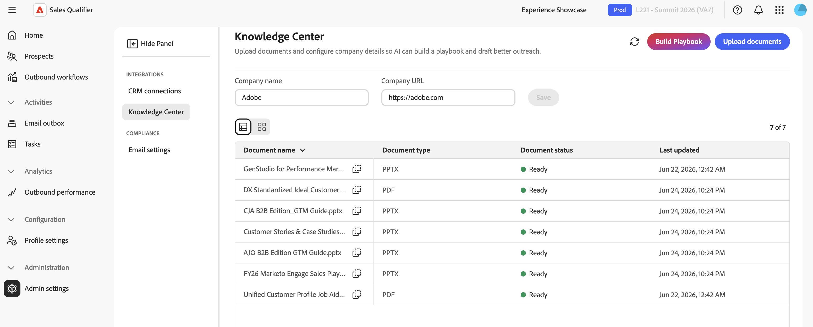

# Impostazioni di amministrazione

Utilizza **[!UICONTROL Impostazioni amministratore]** per configurare le integrazioni CRM, gestire il Knowledge Center e configurare la rinuncia e-mail.

Sales Qualifier si connette a Salesforce o Microsoft Dynamics 365. La connessione offre a Account Qualification Agent (AQA) una visualizzazione coerente di lead, account, contatti, attività e proprietari. Sales Qualifier può anche scrivere le attività di outreach e lo stato di rinuncia al CRM e sincronizzare le attività di outreach con Marketo.

Per configurare le connessioni CRM, il mapping dei campi e la sincronizzazione delle attività, passare a **[!UICONTROL Amministrazione]** > **[!UICONTROL Impostazioni amministratore]** > **[!UICONTROL Connessioni CRM]**. Gli utenti standard possono utilizzare i dati e i filtri CRM configurati, ma non possono modificare queste impostazioni. Per connettere un CRM per la prima volta, vedere [Introduzione](getting-started.md#connect-your-crm).

>[!IMPORTANT]
>
>L&#39;accesso a **[!UICONTROL Impostazioni amministratore]** richiede l&#39;appartenenza ai gruppi di utenti `Sales Qualifier` e `Sales Qualifier Admins`.

## MCP CRM e il plug-in incorporato

Sales Qualifier funziona con il tuo sistema di gestione delle relazioni con i clienti nei seguenti modi:

* **Query MCP CRM**: Account Qualification Agent esegue query sui dati CRM in tempo reale in modo che le risposte e le informazioni riflettano lo stato corrente dei record.
* **Plug-in incorporato**. Il plug-in CRM visualizza informazioni e dati di agente [!DNL Marketo Sales Insights] (MSI) nel CRM. Utilizza il plug-in per aggiungere un potenziale cliente a Sales Qualifier.
* **Sincronizzazione attività** - Quando un amministratore attiva **[!UICONTROL Sincronizzazione attività]**, le attività di outreach vengono sincronizzate con CRM e Marketo.

## Ambito di accesso CRM

Sales Qualifier legge gli utenti, i contatti, le mappature dei proprietari, i lead, gli account, le opportunità e le attività dal CRM. Scrive solo le attività di outreach registrate e lo stato di rinuncia al CRM e sincronizza le attività di outreach con Marketo. L’amministratore del sistema di gestione delle relazioni con i clienti prepara l’accesso API in Salesforce o Dynamics. Un amministratore di Sales Qualifier connette quindi il sistema CRM, mappa i campi in entrata e sceglie se sincronizzare le attività.

>[!NOTE]
>
>I passaggi delle credenziali in [Introduzione](getting-started.md#connect-your-crm) descrivono l&#39;accesso in lettura agli oggetti CRM. Se attivi la sincronizzazione delle attività o la rinuncia al write-back, rivolgiti al tuo amministratore del sistema di gestione delle relazioni con i clienti per concedere l’accesso in scrittura corrispondente richiesto dalla configurazione del sistema di gestione delle relazioni con i clienti.

## Mappa campi CRM (mappatura in entrata)

Dopo aver connesso il CRM, selezionare **[!UICONTROL Gestisci]** per la connessione e aprire **[!UICONTROL Mappatura in entrata]**. La mappatura in entrata controlla quali campi di gestione delle relazioni con i clienti vengono estratti da Sales Qualifier nell’applicazione.

1. Selezionare **[!UICONTROL Aggiungi sezione]**.
1. Immettere un nome e una descrizione per la sezione.
1. Selezionare un tipo di entità. **[!UICONTROL Prospect]** è selezionato per impostazione predefinita. Sono inoltre disponibili **[!UICONTROL Contatti]**, **[!UICONTROL Account]** e **[!UICONTROL Opportunità]**.
1. Seleziona i campi CRM da importare.

   Ogni riga di campo visualizza il relativo **[!UICONTROL Nome visualizzato]**, **[!UICONTROL Nome campo]** e **[!UICONTROL Tipo di dati]**.

1. Attiva **[!UICONTROL Filterable]** per ogni campo prospect, contatto o opportunità che desideri rendere disponibile come filtro nell&#39;elenco **[!UICONTROL Prospect]**.
1. Visualizzare l&#39;anteprima della sezione e selezionare **[!UICONTROL Aggiungi]**.

I campi mappati vengono visualizzati nelle aree corrispondenti di Sales Qualifier:

* I campi prospect vengono visualizzati nella scheda **[!UICONTROL Persona]**.
* I campi Account vengono visualizzati nella scheda **[!UICONTROL Account]**.
* I campi dell&#39;opportunità vengono visualizzati nella sezione **[!UICONTROL Opportunità account]**. I campi delle opportunità filtrabili vengono inoltre visualizzati come colonne proprie in **[!UICONTROL Contatti opportunità personali]**, con etichette quali **[!UICONTROL Fase (opportunità)]** per distinguerli dai campi dei contatti.

## Configurare la sincronizzazione delle attività (mappatura in uscita)

1. Da **[!UICONTROL connessioni CRM]**, selezionare **[!UICONTROL Gestisci]** per il CRM connesso.
1. Apri **[!UICONTROL Mappatura in uscita]**.
1. Attiva **[!UICONTROL Sincronizzazione attività]** per sincronizzare le attività di Sales Qualifier Outreach con CRM e Marketo. Le attività di invio, apertura, clic e risposta dei messaggi e-mail includono il nome del flusso di lavoro in uscita.

Quando la sincronizzazione delle attività è disattivata, Sales Qualifier continua a utilizzare i dati CRM in entrata ma non sincronizza le attività di outreach con il sistema CRM o Marketo.

## Crea un playbook per un Knowledge Center {#knowledge-center}

Il **[!UICONTROL Centro conoscenze]** consente al Account Qualification Agent (AQA) di accedere ai materiali di vendita. Sales Qualifier utilizza questi materiali per generare ricerche, approfondimenti sulle qualifiche e attività di sensibilizzazione che riflettono il modo in cui l’organizzazione vende. Solo gli amministratori possono creare e gestire la playbook.

{width="800" zoomable="yes"}

1. Nel menu di navigazione a sinistra, espandi **[!UICONTROL Amministrazione]**, seleziona **[!UICONTROL Impostazioni amministratore]** e seleziona **[!UICONTROL Centro informazioni]**
1. u
1. Imposta **[!UICONTROL Nome società]** e **[!UICONTROL URL società]** utilizzati da Sales Qualifier per eseguire ricerche nella società e bozze di e-mail.
1. Carica giochi di vendita, profili cliente ideali (ICP), guide di posizionamento e altro materiale promozionale in formato PDF, PPTX o DOCX.
1. Seleziona **[!UICONTROL Genera playbook]**.

In ogni documento caricato viene visualizzato il relativo stato di elaborazione, ad esempio **[!UICONTROL Pronto]**, e la data dell&#39;ultimo aggiornamento.

>[!NOTE]
>
>L&#39;elaborazione di un playbook può richiedere fino a 24 ore.

Quando il playbook è pronto, i rappresentanti possono utilizzarlo in due posizioni:

* **Prompt e-mail in uscita** - In un prompt punto di contatto, assegnare un nome al documento e descrivere il contesto da utilizzare. Immettere ad esempio `Use the ABC positioning guide from the Knowledge Center and focus on the security value proposition`. Consulta [Generare e rivedere i punti di contatto](outbound-workflows.md#step-3-generate-and-review-touchpoints).
* **Chat AI**: fare riferimento al Centro informazioni nella domanda. Immettere ad esempio `From the Knowledge Center, help me position our security solution for ABC Corp before tomorrow's call`. Vedi [Chat AI](ai-assistant.md).

In entrambi i casi, il contenuto generato riflette i messaggi nel playbook anziché la ricerca generica.

## Configurare la rinuncia e-mail globale

1. Nel menu di navigazione a sinistra, espandi **[!UICONTROL Amministrazione]** e seleziona **[!UICONTROL Impostazioni amministratore]**.
1. Seleziona **[!UICONTROL Impostazioni e-mail]** in **[!UICONTROL Conformità]**.
1. Attiva **[!UICONTROL Includi collegamento di rinuncia in ogni e-mail]** per aggiungere un piè di pagina per l&#39;annullamento dell&#39;iscrizione alle e-mail in uscita.
1. In **[!UICONTROL Modello per messaggi di rinuncia]** immettere il testo del piè di pagina. Includi il token `{opt_out_link}` in cui dovrebbe essere visualizzato il collegamento per annullare l&#39;abbonamento.

Le impostazioni vengono salvate automaticamente.

Quando un prospect seleziona il collegamento, Sales Qualifier interrompe l’invio di e-mail al prospect e sincronizza lo stato di rinuncia al CRM connesso.

## Riferimento: parametri API di esempio

Il team di gestione delle relazioni con i clienti può utilizzare questi esempi per confermare che l’accesso in lettura restituisca i campi lead previsti.

### Esempio di Dynamics OData

```text
$select=fullname,_ownerid_value,leadid,emailaddress1,jobtitle,statuscode,createdon,modifiedon,statecode
$filter=_ownerid_value eq '<crmUserId>' [AND additional filters]
$expand=Lead_ActivityPointers(...),parentaccountid(...)
$orderby=modifiedon desc
```

### Esempio di SOQL per Salesforce

```sql
SELECT Id, Salutation, FirstName, LastName, Name, Title, Company, Email,
  LeadSource, Status, OwnerId, LastModifiedDate, LastActivityDate, CreatedDate,
  (SELECT Id, Subject, ActivityDate, Status FROM Tasks ORDER BY ActivityDate DESC LIMIT 1),
  (SELECT Id, Subject, ActivityDateTime FROM Events ORDER BY ActivityDateTime DESC LIMIT 1)
FROM Lead
WHERE OwnerId = '<crmUserId>' AND IsDeleted = false
ORDER BY LastModifiedDate DESC
```

>[!MORELIKETHIS]
>
>* [Introduzione](getting-started.md)
>* [Potenziali clienti](prospects.md)
