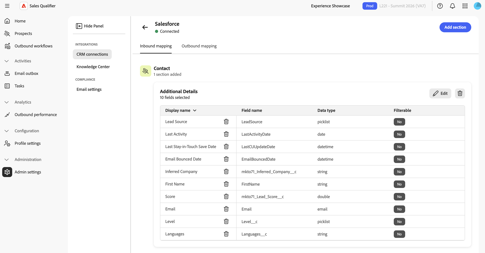

# Integrazioni

Connetti Outlook per inviare e-mail, riconoscere le risposte dei potenziali clienti e pianificare le riunioni. Per rendere disponibili i lead, i contatti, gli account, le opportunità, le attività e i proprietari per Account Qualification Agent (AQA) e i flussi di lavoro in uscita, è inoltre possibile collegare Sales Qualifier a Salesforce o Microsoft Dynamics 365. Sales Qualifier legge i dati CRM, può riscrivere le attività di outreach e lo stato di rinuncia al CRM e può sincronizzare le attività di outreach con Marketo. In caso contrario, non modifica i record CRM.

Questo articolo spiega come connettere Outlook, gestire una connessione CRM, mappare i campi, sincronizzare le attività e configurare la rinuncia alle e-mail. Per connettere un CRM per la prima volta, vedere [Introduzione](getting-started.md#connect-your-crm).

>[!IMPORTANT]
>
>La connessione Outlook è per rappresentante. Le impostazioni di gestione delle relazioni con i clienti e di conformità descritte più avanti in questo articolo si applicano all’intera organizzazione. Per accedere a tali impostazioni a livello di organizzazione, è necessario appartenere ai gruppi di utenti `Sales Qualifier` e `Sales Qualifier Admins`. Gli utenti standard possono utilizzare i dati e i filtri CRM configurati, ma non possono modificare le impostazioni. Consulta [Ruoli utente e autorizzazioni](user-roles-permissions.md).

## Connetti Outlook

Ogni rappresentante connette il proprio account di Outlook:

1. Selezionare **[!UICONTROL Connetti Outlook]**.
1. Accedi con il tuo account Microsoft.
1. Rivedi e approva l’accesso richiesto.

La connessione consente a Sales Qualifier di inviare messaggi dalla cassetta postale, riconoscere quando un potenziale cliente risponde e pianificare riunioni nel calendario.

Quando ti connetti, approvi l’accesso che consente a Sales Qualifier di:

* Riconoscere le risposte dei potenziali clienti.
* Crea e invia e-mail per tuo conto.
* Utilizzare il calendario per pianificare le riunioni.
* Leggi il fuso orario della tua cassetta postale e le ore lavorative per la pianificazione.
* Rimani connesso automaticamente in modo che queste funzioni continuino a funzionare senza richiedere di nuovo l&#39;accesso.

### Approvazioni di Outlook (se necessario)

Per impostazione predefinita, non è richiesta alcuna azione da parte dell’amministratore. Ogni rappresentante approva autonomamente l&#39;accesso quando connette Outlook.

Se l’organizzazione ha disattivato il consenso degli utenti alle app di terze parti in Microsoft 365 o Microsoft Entra, un amministratore Microsoft 365 o Entra deve approvare Sales Qualifier una volta per l’intera organizzazione. L&#39;amministratore completa l&#39;approvazione prima che i rappresentanti connettano i propri account di Outlook. Dopo l’approvazione a livello di organizzazione, ogni rappresentante può collegare il proprio account.

### Gestione dei dati delle cassette postali in Sales Qualifier

Sales Qualifier legge solo le risposte alle e-mail inviate, non il resto della casella in entrata. Non memorizza gli allegati o le e-mail in arrivo al di fuori di un progetto attivo. Le credenziali di accesso archiviate sono crittografate.

## Apri impostazioni CRM

Nel menu di navigazione a sinistra, espandi **[!UICONTROL Amministrazione]** e seleziona **[!UICONTROL Impostazioni amministratore]**. Le impostazioni sono organizzate in due gruppi:

| Gruppo | Elementi |
| --- | --- |
| **[!UICONTROL Integrazioni]** | **[!UICONTROL Connessioni CRM]**, **[!UICONTROL Centro informazioni]** |
| **[!UICONTROL Conformità]** | **[!UICONTROL Impostazioni e-mail]** |

Per il Centro informazioni, vedere [Centro informazioni](knowledge-center.md).

## Gestire le connessioni CRM

Seleziona **[!UICONTROL connessioni CRM]**. La pagina contiene schede per **[!UICONTROL Salesforce]** e **[!UICONTROL Microsoft]** (Microsoft Dynamics 365). Ogni scheda mostra uno dei seguenti stati:

| Stato | Significato |
| --- | --- |
| **[!UICONTROL Connesso]** | La connessione è attiva e autenticata. |
| **[!UICONTROL Non attivo]** | Nessuna connessione configurata per questo CRM. |
| **[!UICONTROL Autorizzazioni richieste]** | La connessione è autenticata, ma mancano gli ambiti richiesti. Nella scheda sono elencati gli ambiti mancanti. |

>[!NOTE]
>
>Può essere attivo un solo CRM alla volta. Quando un CRM è connesso, l&#39;altra scheda è disabilitata. Disconnetti il CRM attivo prima di connetterne uno diverso.

Una scheda non configurata mostra **[!UICONTROL Connetti]**. Una scheda configurata mostra **[!UICONTROL Gestisci]** e un menu **[!UICONTROL Altro]** con **[!UICONTROL Modifica configurazione]** e **[!UICONTROL Disconnetti]**.

### Connettere o modificare una connessione

1. Sulla scheda del sistema di gestione delle relazioni con i clienti, seleziona **[!UICONTROL Connetti]** oppure **[!UICONTROL Altro]** > **[!UICONTROL Modifica configurazione]** per aggiornare una connessione esistente.
1. Immettere le credenziali dall&#39;amministratore del sistema CRM.

   >[!BEGINTABS]

   >[!TAB Salesforce]

   Immetti **[!UICONTROL ID client (chiave consumer)]**, **[!UICONTROL URL istanza]** e **[!UICONTROL Segreto client]**. Utilizzare il modulo URL dell&#39;istanza canonica `https://{{mydomain}}.my.salesforce.com`.

   {width="800" zoomable="yes"}

   >[!TAB Microsoft Dynamics]

   Immetti **[!UICONTROL ID client (chiave consumer)]**, **[!UICONTROL ID tenant]**, **[!UICONTROL URL istanza Microsoft Dynamics]** e **[!UICONTROL Segreto client]**. Utilizzare il modulo URL dell&#39;istanza canonica `https://{{mydomain}}.crm.dynamics.com`.

   >[!ENDTABS]

1. Seleziona **[!UICONTROL Connetti]** (o **[!UICONTROL Salva]** durante la modifica).

Se Sales Qualifier rifiuta le credenziali, identifica la causa, ad esempio credenziali non valide o scadute, autorizzazioni mancanti o un tenant Dynamics non riconosciuto. Correggi il valore e riprova.

>[!IMPORTANT]
>
>Non inviare i segreti del cliente tramite e-mail. Utilizza il canale sicuro approvato della tua organizzazione per condividere le credenziali con chi le immette in Sales Qualifier.

### Disconnettere una connessione

1. Sulla scheda CRM connessa, selezionare **[!UICONTROL Altro]** > **[!UICONTROL Disconnetti]**.
1. Rivedi l&#39;avviso e seleziona **[!UICONTROL Disconnetti]** per confermare.

>[!WARNING]
>
>Quando si disconnette un CRM, i flussi di lavoro in uscita vengono sospesi per tutti i potenziali clienti dell&#39;organizzazione e nessun nuovo potenziale viene sincronizzato dal CRM fino alla riconnessione.

## Mappa campi CRM (mappatura in entrata) {#map-crm-fields-inbound-mapping}

La mappatura in entrata controlla quali campi CRM importa in Sales Qualifier e dove compaiono. I campi sono raggruppati in sezioni e ogni sezione appartiene a un tipo di entità.

1. Sulla scheda CRM connessa, selezionare **[!UICONTROL Gestione]**.
1. Nella scheda **[!UICONTROL Inbound mapping]**, selezionare **[!UICONTROL Add section]**.
1. Nel passaggio **Seleziona sezione**, scegli il tipo di entità, quindi seleziona **[!UICONTROL Successivo]**:

   | Entità | Dove vengono visualizzati i campi |
   | --- | --- |
   | **[!UICONTROL Potenziali clienti]** | Scheda **[!UICONTROL Persona]** di un prospect. |
   | **[!UICONTROL Contatti]** | Record del contatto. |
   | **[!UICONTROL Account]** | Scheda **[!UICONTROL Account]**. Vedi [Account](accounts.md). |
   | **[!UICONTROL Opportunità]** | I dettagli dell’opportunità dell’account. |

1. Immettere un **[!UICONTROL nome sezione]** e una **[!UICONTROL descrizione]** facoltativa. Quindi, seleziona **[!UICONTROL Avanti]**.
1. Nel passaggio **[!UICONTROL Aggiungi campo]**, cerca e seleziona i campi CRM da importare. Quindi, seleziona **[!UICONTROL Avanti]**. Ogni campo contiene **[!UICONTROL Nome visualizzato]**, **[!UICONTROL Nome campo]** e **[!UICONTROL Tipo dati]**.
1. Per le sezioni **[!UICONTROL Potenziali]**, **[!UICONTROL Contatti]** e **[!UICONTROL Opportunità]**, attiva **[!UICONTROL Filterabile]** per ogni campo necessario ai rappresentanti nell&#39;elenco [Potenziali](prospects.md).

   Un campo non può essere reso filtrabile se il relativo tipo di dati non supporta il filtro o se è già utilizzato in un’altra sezione.

   In **[!UICONTROL Contatti opportunità personali]**, i campi delle opportunità filtrabili vengono visualizzati come colonne separate con etichette quali **[!UICONTROL Fase (opportunità)]**. Il suffisso distingue gli attributi opportunità dai campi del contatto associato.

1. Nel passaggio **[!UICONTROL Anteprima]**, conferma la selezione e seleziona **[!UICONTROL Aggiungi]**.

Per modificare una sezione in un secondo momento, selezionare **[!UICONTROL Modifica]** nella scheda della sezione. Per rimuovere una sezione, selezionare **[!UICONTROL Rimuovi]** nella scheda della sezione. Per rimuovere un singolo campo, seleziona l’azione di eliminazione nella riga del campo. Confermare ogni rimozione.

## Configurare la sincronizzazione delle attività (mappatura in uscita) {#configure-activity-sync-outbound-mapping}

Sincronizzazione attività scrive le attività di Sales Qualifier outreach nel CRM e nel Marketo. Le attività di invio, apertura, clic e risposta dei messaggi e-mail includono il nome del flusso di lavoro in uscita. I rappresentanti possono visualizzare le attività nella gestione delle relazioni con i clienti, mentre i team di marketing possono utilizzare le attività di Marketo nelle timeline di lead scoring e coinvolgimento.

1. Sulla scheda CRM connessa, selezionare **[!UICONTROL Gestione]**.
1. Apri la scheda **[!UICONTROL Mapping in uscita]**.
1. Attiva **[!UICONTROL Sincronizzazione attività]**. L&#39;impostazione viene salvata immediatamente.

Quando la sincronizzazione delle attività è disattivata, Sales Qualifier continua a utilizzare i dati CRM in entrata ma non sincronizza le attività di outreach con il sistema CRM o Marketo.

>[!NOTE]
>
>La sincronizzazione delle attività richiede l’accesso in scrittura nel CRM. Se manca l&#39;autorizzazione richiesta, lo switch è disabilitato e Sales Qualifier richiede di contattare l&#39;amministratore. Per concedere l’accesso in scrittura all’attività, rivolgiti al tuo amministratore CRM.

## Configurare gli elementi di rilievo del marketing {#turn-on-marketo-engagement-filtering}

Marketing Highlights consente ai rappresentanti di trovare e assegnare la priorità ai potenziali clienti in base al loro coinvolgimento live [!DNL Marketo], ad esempio aperture di e-mail e clic. Vedi [Filtra per coinvolgimento Marketo](prospects.md#filter-by-marketo-engagement).

Un amministratore completa una configurazione una tantum che connette [!DNL Marketo] a Sales Qualifier per l&#39;organizzazione e la sandbox pertinenti. La configurazione prevede la creazione di credenziali API in Adobe Developer Console, la configurazione di un webhook in [!DNL Marketo] e l&#39;aggiunta di tale webhook a una campagna avanzata di attivazione. Per i passaggi completi, consulta [Imposta elementi di rilievo marketing](marketing-highlights-setup.md).

Marketing Highlights è disponibile in tutte le aree di produzione: Nord America, EMEA e Australia.

## Configurare la rinuncia e-mail globale {#configure-global-email-opt-out}

L’impostazione di rinuncia aggiunge un piè di pagina per l’annullamento dell’iscrizione a ogni e-mail in uscita. Gli utenti standard non possono disattivarla per un singolo messaggio e-mail.

1. Nel menu di navigazione a sinistra, espandi **[!UICONTROL Amministrazione]** e seleziona **[!UICONTROL Impostazioni amministratore]**.
1. Seleziona **[!UICONTROL Impostazioni e-mail]** in **[!UICONTROL Conformità]**.
1. Attiva **[!UICONTROL Includi collegamento di rinuncia in ogni e-mail]**.
1. In **[!UICONTROL Modello per messaggi di rinuncia]** immettere il testo del piè di pagina. Includi il token `{opt_out_link}` in cui dovrebbe essere visualizzato il collegamento per l&#39;annullamento dell&#39;abbonamento cliccabile.

   Ad esempio: `If you'd prefer not to receive these emails, you can {opt_out_link}.`

L’impostazione e il modello vengono salvati automaticamente.

Quando un prospect seleziona il collegamento, Sales Qualifier smette di inviare e-mail a tale prospect e sincronizza lo stato di rinuncia al CRM connesso.

## Ambito di accesso CRM

Sales Qualifier legge le entità del sistema di gestione delle relazioni con i clienti di cui ha bisogno e riscrive solo un set definito di dati:

* **Lettura**: utenti, contatti, mapping proprietari, lead, account, opportunità e attività.
* **Scrittura** - Attività di outreach registrate (quando [sincronizzazione attività](#configure-activity-sync-outbound-mapping) è attiva) e stato di rinuncia.

L’amministratore del sistema di gestione delle relazioni con i clienti prepara l’accesso API in Salesforce o Dynamics. Un amministratore di Sales Qualifier connette quindi il sistema CRM, mappa i campi in entrata e sceglie se sincronizzare le attività. La connessione iniziale richiede l&#39;accesso in sola lettura. La sincronizzazione delle attività e la rinuncia al write-back richiedono l’accesso in scrittura corrispondente.

>[!MORELIKETHIS]
>
>* [Introduzione](getting-started.md)
>* [Ruoli utente e autorizzazioni](user-roles-permissions.md)
>* [Account](accounts.md)
